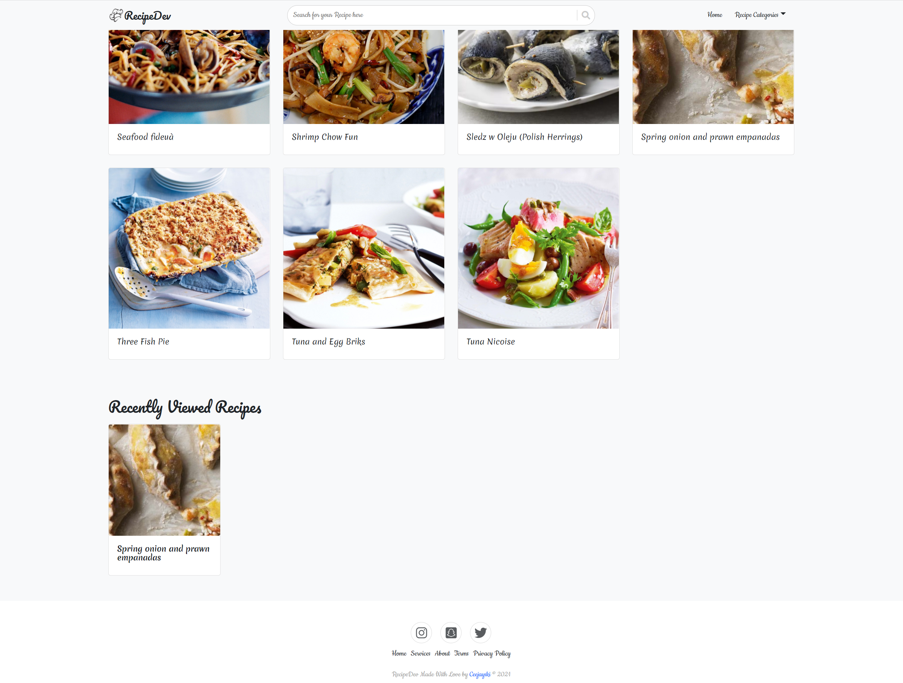

# CAPSTONE PROJECT: RecipeDev
This is a goto Recipe Site in react
 
 ## Live Demo:
[Recipe-Dev](https://pedantic-pasteur-a8bcbb.netlify.app/)

## Screenshot

    
    

## Video presentation
[video](https://www.loom.com/share/d7cc9642eef24da0a7b6f68e5ff2fcee)

## Built-With

- React
- Redux
- TheMealDB Api
- Jest
- Css3

## Getting Started

**To get this project set up on your local machine, follow these simple steps:**

1. Clone this project: git clone https://github.com/Ceejayski/Recipe-dev.git
2. Cd into the cloned directory
3. Install the required dependencies by using: `npm install`
4. run `npm run start` to display the project on the browser

**And to run the test on your local machine, follow these simple steps:**
1. Install jest using `npm install --save-dev jest` if it's not already in the package.json. 
2. run `npm test` 

## Author Details:

👤 **Okoli Chijioke**

- Github: [@ceejayski](https://github.com/ceejayski)

- LinkedIn: [LinkedIn](https://www.linkedin.com/in/okoli-ceejay/)
## Show your support

Kindly ⭐ Star this project on GitHub — it helps!

## Acknowledgments

- My thanks goes to Microverse and all our peers and colleagues there.
